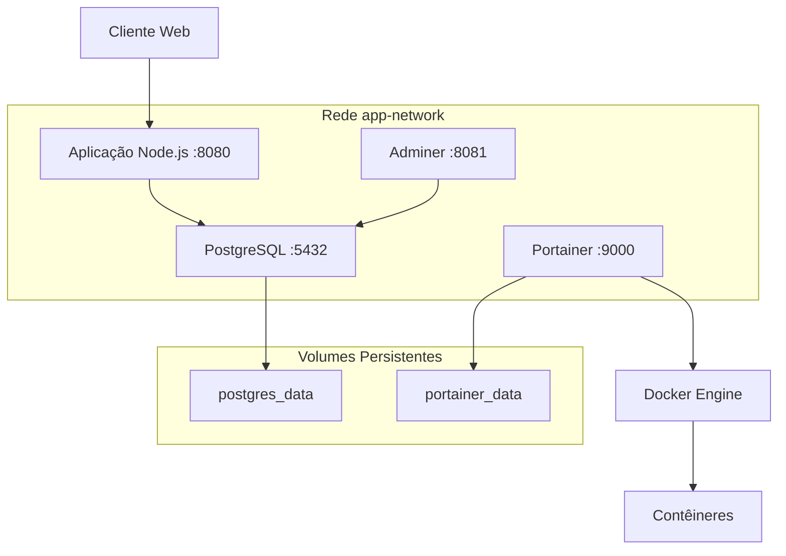

# 🐳 Sistema Distribuído - Trabalho de Contêineres Docker

Este projeto implementa um ambiente completo baseado em contêineres Docker com orquestração via Docker Compose, desenvolvido para a disciplina de Sistemas Distribuídos.

## 📋 Especificações Atendidas

### ✅ Contêineres Implementados

1. **🌐 Servidor Web (Node.js + Express)**

   - Aplicação web desenvolvida em Node.js
   - Conecta ao banco PostgreSQL
   - Interface web para gerenciar usuários
   - Disponível na porta 8080 da máquina local

2. **🗄️ Banco de Dados (PostgreSQL)**

   - Armazenamento persistente de dados
   - Dados não se perdem ao desligar o contêiner
   - Disponível apenas localmente para outros contêineres
   - Inicialização automática com dados de exemplo

3. **🔧 Adminer**

   - Interface web para administração do banco
   - Acesso completo ao PostgreSQL
   - Disponível em http://localhost:8081

4. **🐳 Portainer**
   - Gerenciamento gráfico dos contêineres
   - Monitoramento em tempo real
   - Disponível em http://localhost:9000

## 🚀 Como Executar

### Pré-requisitos

- Docker instalado
- Docker Compose instalado

### Passos para Execução

1. **Clone ou baixe os arquivos do projeto**
2. **Organize a estrutura de pastas:**

   ```
   projeto/
   ├── docker-compose.yml
   ├── Dockerfile
   ├── package.json
   ├── init.sql
   ├── src/
   │   └── server.js
   ├── views/
   │   └── index.ejs
   └── README.md
   ```

3. **Execute o comando no terminal:**

   ```bash
   docker-compose up -d
   ```

4. **Aguarde a inicialização dos contêineres (aproximadamente 2-3 minutos)**

## 🌐 Acessos aos Serviços

| Serviço         | URL                          | Descrição                    |
| --------------- | ---------------------------- | ---------------------------- |
| **Sistema Web** | http://localhost:8080        | Aplicação principal          |
| **Adminer**     | http://localhost:8081        | Administração do banco       |
| **Portainer**   | http://localhost:9000        | Gerenciamento de contêineres |
| **API Status**  | http://localhost:8080/status | Status da aplicação          |

## 🔐 Credenciais do Banco de Dados

- **Host:** postgres (interno) / localhost:5432 (externo)
- **Banco:** sistema_db
- **Usuário:** usuario
- **Senha:** senha123

### Para acessar via Adminer:

1. Abra http://localhost:8081
2. Sistema: PostgreSQL
3. Servidor: postgres
4. Usuário: usuario
5. Senha: senha123
6. Base de dados: sistema_db

## 🛠️ Funcionalidades da Aplicação Web

- ➕ **Adicionar usuários:** Nome, e-mail e idade
- 👥 **Listar usuários:** Visualização em cards com informações completas
- 🗑️ **Deletar usuários:** Remoção com confirmação
- 📊 **Estatísticas:** Contadores em tempo real
- 🔗 **Links rápidos:** Acesso direto aos outros serviços

## 🏗️ Arquitetura do Sistema



## 📦 Componentes Técnicos

### Backend (Node.js)

- **Express.js:** Framework web
- **pg:** Driver PostgreSQL
- **EJS:** Template engine
- **Body-parser:** Middleware para parsing

### Banco de Dados (PostgreSQL)

- **Versão:** 15-alpine
- **Persistência:** Volume Docker
- **Inicialização:** Script SQL automático

### Orquestração (Docker Compose)

- **Rede customizada:** app-network
- **Volumes persistentes:** postgres_data, portainer_data
- **Dependências:** Ordem correta de inicialização

## 🔧 Comandos Úteis

```bash
# Iniciar todos os serviços
docker-compose up -d

# Ver logs em tempo real
docker-compose logs -f

# Parar todos os serviços
docker-compose down

# Parar e remover volumes (CUIDADO: perde dados)
docker-compose down -v

# Rebuild da aplicação
docker-compose build --no-cache web-app

# Ver status dos contêineres
docker-compose ps

# Entrar no contêiner da aplicação
docker-compose exec web-app sh

# Entrar no contêiner do banco
docker-compose exec postgres psql -U usuario -d sistema_db
```

## 🐛 Troubleshooting

### Problema: Porta já em uso

```bash
# Verificar processos usando as portas
netstat -tulpn | grep :8080
netstat -tulpn | grep :8081
netstat -tulpn | grep :9000

# Parar processo específico
sudo kill -9 <PID>
```

### Problema: Contêiner não inicia

```bash
# Ver logs detalhados
docker-compose logs <nome-do-servico>

# Exemplo
docker-compose logs web-app
docker-compose logs postgres
```

### Problema: Banco não conecta

```bash
# Verificar se o PostgreSQL está rodando
docker-compose exec postgres pg_isready -U usuario

# Conectar manualmente ao banco
docker-compose exec postgres psql -U usuario -d sistema_db -c "SELECT NOW();"
```

## 📊 Monitoramento

### Verificar saúde dos contêineres:

```bash
# Status geral
docker-compose ps

# Recursos utilizados
docker stats

# Logs específicos
docker-compose logs -f <servico>
```

### Endpoints de status:

- **Aplicação:** GET http://localhost:8080/status
- **Banco:** Através do Adminer
- **Contêineres:** Através do Portainer

## 🎯 Objetivos Alcançados

- ✅ **4 contêineres funcionais** conforme especificação
- ✅ **Persistência de dados** garantida via volumes
- ✅ **Isolamento de rede** com acesso controlado
- ✅ **Interface web funcional** com CRUD completo
- ✅ **Administração de banco** via Adminer
- ✅ **Gerenciamento visual** via Portainer
- ✅ **Orquestração completa** com Docker Compose

## 👥 Informações do Trabalho

- **Disciplina:** Sistemas Distribuídos
- **Valor:** 10,0 pontos
- **Grupos:** Até 3 pessoas
- **Tecnologias:** Docker, Node.js, PostgreSQL, Adminer, Portainer

---

**🎬 Para o vídeo de demonstração, mostre:**

1. Execução do `docker-compose up -d`
2. Acesso à aplicação em http://localhost:8080
3. Adicionar/remover usuários
4. Demonstração do Adminer
5. Demonstração do Portainer
6. Explicação do arquivo docker-compose.yml
